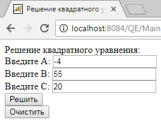
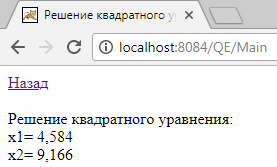
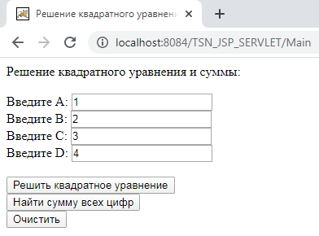
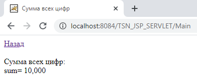

# TSN_JSP_SERVLET
Пример Web-приложения на Java с использованием JSP и Servlet в NetBeans









# Для работы Tomcat по сети добавить строку "address="0.0.0.0" в файле
  "C:\Program Files\Apache Software Foundation\Apache Tomcat 8.0.27\conf\server.xml":
```
    <Connector port="8080" protocol="HTTP/1.1"
               connectionTimeout="20000"
               address="0.0.0.0"
               redirectPort="8443" />
```